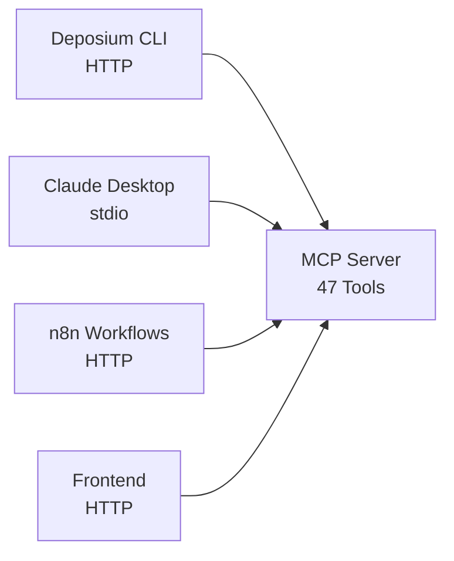

# 🚀 Deposium CLI

Official command-line interface for [Deposium MCP Server](https://github.com/theseedship/deposium_MCPs) - document search, graph queries, and AI workflows.

## 📋 Overview

Deposium CLI is a **lightweight wrapper** around the Deposium MCP Server that provides:

- 🔍 **Search**: DuckDB VSS, FTS, and fuzzy matching
- 🔗 **Graph**: Network analysis and path finding
- 📊 **Corpus**: Statistics and quality evaluation
- 🤖 **Compound AI**: Multi-tool reasoning with Groq
- 🎨 **Interactive mode**: REPL for exploration

**Architecture:** TypeScript client → HTTP → MCP Server (47 tools)

## 🌟 Key Features

- ✅ **Zero duplication**: All logic lives in MCP Server
- ✅ **Type-safe**: Shares schemas with MCP Server
- ✅ **Secure authentication**: API key validation with automatic retry
- ✅ **Multiple formats**: JSON, Table, Markdown output
- ✅ **Configuration**: Persistent settings (tenant, space, format)
- ✅ **Interactive mode**: User-friendly REPL
- ✅ **CI/CD ready**: Silent mode for automation
- ✅ **Triple distribution**: npm, Bun binary, Docker

## 📦 Installation

### Option 1: npm (Recommended for end-users)

```bash
npm install -g @deposium/cli

# Verify installation
deposium --version
```

### Option 2: Bun Binary (Recommended for production/CI)

```bash
# Linux
curl -fsSL https://github.com/theseedship/deposium_CLI/releases/latest/download/deposium-linux -o deposium
chmod +x deposium
sudo mv deposium /usr/local/bin/

# macOS
curl -fsSL https://github.com/theseedship/deposium_CLI/releases/latest/download/deposium-macos -o deposium
chmod +x deposium
sudo mv deposium /usr/local/bin/

# Windows
# Download from: https://github.com/theseedship/deposium_CLI/releases/latest/download/deposium-windows.exe
```

### Option 3: Docker

```bash
docker pull deposium/cli:latest

# Run with alias
alias deposium='docker run -it --rm deposium/cli'
```

## 🛠️ Local Installation (Development)

Install and test the CLI locally without publishing to npm. Perfect for development, testing, and contributing.

### Prerequisites

```bash
# Clone and setup
git clone https://github.com/theseedship/deposium_CLI.git
cd deposium_CLI
npm install

# Build the project first (required for all methods)
npm run build
```

### Method 1: npm link (Recommended for active development)

Creates a **symlink** to your local package. Changes are reflected immediately after rebuilding.

```bash
npm run build
npm link

# Test it works
deposium --version

# Uninstall when done
npm unlink -g @deposium/cli
```

**✅ Best for:**

- Active development with frequent code changes
- Hot-reload workflow (rebuild + test immediately)
- Quick iteration cycles

**⚠️ Note:** Changes require `npm run build` to take effect.

### Method 2: npm install -g . (Classic global install)

Installs the package globally from your local directory, like a real npm install.

```bash
npm run build
npm install -g .

# Test it works
deposium --version

# Uninstall when done
npm uninstall -g @deposium/cli
```

**✅ Best for:**

- Testing the full installation experience
- Verifying the package works as a standard npm package
- Integration testing

**⚠️ Note:** Requires reinstalling after each code change.

### Method 3: npm pack (Simulates production install)

Creates a **tarball** (.tgz) exactly as npm publish would, then installs from it. Most realistic production simulation.

```bash
npm run build
npm pack
# Creates: deposium-cli-1.0.0.tgz

npm install -g ./deposium-cli-1.0.0.tgz

# Test it works
deposium --version

# Uninstall when done
npm uninstall -g @deposium/cli
rm deposium-cli-1.0.0.tgz
```

**✅ Best for:**

- Pre-publish validation
- Testing exactly what will be published to npm
- Verifying package.json "files" field
- Finding missing dependencies or files

### Method 4: Bun Binary (Production-ready executable)

Compiles a **standalone binary** with zero dependencies. Same as production releases.

```bash
# Build for your platform
npm run build:bun-linux    # Linux x64
npm run build:bun-macos    # macOS x64
npm run build:bun-windows  # Windows x64

# Or build all platforms
npm run build:all

# Test the binary directly
./dist/deposium-linux --version

# Or install globally
sudo cp ./dist/deposium-linux /usr/local/bin/deposium
deposium --version

# Uninstall
sudo rm /usr/local/bin/deposium
```

**✅ Best for:**

- Testing production binaries
- Distribution without Node.js dependency
- CI/CD environments
- End-user testing

**⚠️ Requires:** Bun runtime installed (`curl -fsSL https://bun.sh/install | bash`)

### Method 5: npm run dev (No installation)

Run directly from source without any installation. Fastest for quick tests.

```bash
npm run dev -- --version
npm run dev -- search "test query"
npm run dev -- health
```

**✅ Best for:**

- Quick testing during development
- Debugging with TypeScript source maps
- No global installation needed

### Comparison Table

| Method               | Install Time | Reflects Changes   | Production-Like | Best Use Case          |
| -------------------- | ------------ | ------------------ | --------------- | ---------------------- |
| **npm link**         | Fast         | ✅ After rebuild   | ❌              | Active development     |
| **npm install -g .** | Fast         | ❌ Needs reinstall | ⚠️ Partial      | Standard testing       |
| **npm pack**         | Medium       | ❌ Needs repack    | ✅ Exact        | Pre-publish validation |
| **Bun binary**       | Slow         | ❌ Needs rebuild   | ✅ Perfect      | Production testing     |
| **npm run dev**      | Instant      | ✅ Immediate       | ❌              | Quick debugging        |

### Quick Helper Scripts

Add to your workflow with these npm scripts (already in `package.json`):

```bash
# Install locally with symlink
npm run install:local

# Uninstall local symlink
npm run uninstall:local

# Create and install from tarball
npm run pack:local
```

### Troubleshooting Local Installation

**Command not found after installation:**

```bash
# Check npm global bin path
npm bin -g

# Add to PATH if needed (add to ~/.bashrc or ~/.zshrc)
export PATH="$PATH:$(npm bin -g)"
```

**Permission denied:**

```bash
# For npm installs
sudo npm install -g .

# For binaries
chmod +x ./dist/deposium-linux
```

**Old version still showing:**

```bash
# Clear npm cache
npm cache clean --force

# Reinstall
npm uninstall -g @deposium/cli
npm install -g .
```

## ⚙️ Quick Start

### 1. Configure MCP Server URL

```bash
# Set MCP server endpoint (required)
deposium config set mcp-url http://localhost:4001

# Optional: Set defaults
deposium config set default-tenant mycompany
deposium config set default-space production
deposium config set output-format table

# View all config
deposium config get
```

### 2. Check Health

```bash
# Simple health check
deposium health

# Detailed health (all services)
deposium health --verbose
```

### 3. Authenticate with API Key

The CLI requires authentication to access the MCP Server:

```bash
# Automatic authentication (recommended)
deposium search "test"
# → Will prompt for API key on first use
# → Stores key securely in ~/.deposium/config.json

# Manual authentication
deposium auth login
# → Interactive prompt with validation (3 attempts)

# Check authentication status
deposium auth status
# → Shows login status and validates key with server

# Logout (remove stored credentials)
deposium auth logout
```

**Getting your API key:**

- Development: Use `MCP_API_KEY` from the MCP Server's `.env` file
- Production: Contact your Deposium administrator

### 4. Search Documents

```bash
# Basic search
deposium search "machine learning"

# With options
deposium search "AI ethics" \
  --tenant=research \
  --space=papers \
  --top-k=20 \
  --format=json

# Semantic search (vector)
deposium search "deep neural networks" --vector

# Full-text search
deposium search "exact phrase match" --fts

# Fuzzy search (typo-tolerant)
deposium search "machne lerning" --fuzzy
```

## 📚 Commands

### Authentication

```bash
# Login with API key
deposium auth login

# Check authentication status
deposium auth status

# Logout (remove credentials)
deposium auth logout
```

**Authentication flow:**

- ✅ First use → Prompts for API key automatically
- ✅ Key stored in `~/.deposium/config.json`
- ✅ All subsequent commands use stored key
- ✅ Validates key with MCP Server before saving
- ✅ Retry logic (3 attempts) with helpful error messages
- ✅ Secure: API key sent via `X-Api-Key` header

### Search

```bash
# Search with defaults
deposium search <query>

# Options
  -t, --tenant <id>        Tenant ID (default: from config)
  -s, --space <id>         Space ID (default: from config)
  -k, --top-k <number>     Number of results (default: 10)
  --vector                 Use vector search (semantic)
  --fts                    Use full-text search
  --fuzzy                  Use fuzzy matching
  --graph                  Include graph traversal
  -f, --format <type>      Output format: json|table|markdown (default: table)
  --silent                 Suppress progress messages
```

### Graph

```bash
# Analyze graph structure
deposium graph analyze

# Find path between entities
deposium graph path <from-id> <to-id>

# Find strongly connected components
deposium graph components

# Options
  -t, --tenant <id>        Tenant ID
  -s, --space <id>         Space ID
  -f, --format <type>      Output format: json|table
```

### Corpus

```bash
# Get corpus statistics
deposium corpus stats

# Evaluate corpus quality (LLM-as-judge)
deposium corpus evaluate --metric=relevance

# Options
  -t, --tenant <id>        Tenant ID
  -s, --space <id>         Space ID
  --metric <name>          Evaluation metric: relevance|coherence|diversity
  -f, --format <type>      Output format: json|table
```

### Compound AI

```bash
# Deep reasoning with multi-tool orchestration
deposium compound analyze "Explain quantum computing"

# Topic research with web search
deposium compound research "Latest trends in AI"

# Options
  -f, --format <type>      Output format: json|markdown (default: markdown)
```

### Config

```bash
# Set configuration
deposium config set <key> <value>

# Get configuration
deposium config get [key]

# Delete configuration
deposium config delete <key>

# Reset all configuration
deposium config reset

# Show config file path
deposium config path

# Valid keys
  mcp-url           MCP Server endpoint
  api-key           API key for authentication (use 'deposium auth login' instead)
  default-tenant    Default tenant ID
  default-space     Default space ID
  output-format     Default output format (json|table|markdown)
  silent-mode       Suppress progress (true|false)
```

### Health

```bash
# Simple health check
deposium health

# Detailed health (all services)
deposium health --verbose

# JSON output
deposium health --format=json
```

### Interactive Mode

```bash
# Start REPL
deposium interactive

# Or short form
deposium i
```

Interactive mode provides:

- 🔍 Guided search with prompts
- 🔗 Graph operations menu
- 📊 Corpus analysis
- 🤖 Compound AI questions
- 🏥 Health checks

## 🎯 Use Cases

### 1. Development & Testing

```bash
# Quick searches during development
deposium search "API authentication" --format=json | jq '.results[0]'

# Test graph connectivity
deposium graph analyze --verbose
```

### 2. CI/CD Integration

```bash
#!/bin/bash
# ci-test.sh

# Run quality checks
QUALITY=$(deposium corpus evaluate --silent --format=json | jq '.score')

if (( $(echo "$QUALITY < 0.8" | bc -l) )); then
  echo "❌ Quality check failed: $QUALITY"
  exit 1
fi

echo "✅ Quality check passed: $QUALITY"
```

### 3. Shell Scripts & Automation

```bash
# Batch search
cat queries.txt | while read query; do
  deposium search "$query" --silent --format=json >> results.json
done

# Monitor corpus stats
deposium corpus stats --format=json | \
  jq '{documents: .total_documents, entities: .total_entities}'
```

### 4. Data Analysis

```bash
# Export graph to JSON for analysis
deposium graph analyze --format=json > graph.json

# Python analysis
python3 << EOF
import json
with open('graph.json') as f:
    graph = json.load(f)
    print(f"Nodes: {graph['total_nodes']}")
    print(f"Edges: {graph['total_edges']}")
EOF
```

## 🔧 Advanced Usage

### Output Formats

#### JSON (Machine-readable)

```bash
deposium search "query" --format=json | jq '.results[0].content'
```

#### Table (Human-readable)

```bash
deposium search "query" --format=table
# ┌────────┬─────────────┬───────┐
# │ ID     │ Content     │ Score │
# ├────────┼─────────────┼───────┤
# │ doc1   │ ...         │ 0.95  │
# └────────┴─────────────┴───────┘
```

#### Markdown (Documentation)

```bash
deposium search "query" --format=markdown > results.md
```

### Environment Variables

```bash
# Override config with env vars
export DEPOSIUM_MCP_URL=http://localhost:4001
export DEPOSIUM_TENANT=production
export DEPOSIUM_SPACE=main

deposium search "query"  # Uses env vars
```

### Piping & Chaining

```bash
# Chain commands
deposium search "ML" --format=json | \
  jq '.results[].id' | \
  xargs -I {} deposium graph path {} target-id

# Save and reuse results
deposium corpus stats --format=json > stats.json
cat stats.json | jq '.total_documents'
```

## 🏗️ Development

> **💡 Want to install the CLI locally for testing?** See [🛠️ Local Installation (Development)](#️-local-installation-development) for multiple installation methods including `npm link`, `npm pack`, and more.

### Setup

```bash
# Clone repository
git clone https://github.com/theseedship/deposium_CLI.git
cd deposium_CLI

# Install dependencies
npm install

# Run in dev mode (no installation needed)
npm run dev search "test query"

# Type checking
npm run typecheck

# Linting
npm run lint
npm run lint:fix

# Format code
npm run format
```

### Build

```bash
# TypeScript → JavaScript
npm run build

# Test built version
npm run start search "test"

# Build Bun binaries (all platforms)
npm run build:all

# Single platform
npm run build:bun-linux
npm run build:bun-macos
npm run build:bun-windows
```

### Testing

```bash
# Unit tests
npm test

# Integration tests (requires MCP server running)
./tests/integration.sh
```

## 📂 Project Structure

```
deposium_CLI/
├── src/
│   ├── cli.ts                # Entry point
│   ├── client/
│   │   └── mcp-client.ts     # HTTP client for MCP Server
│   ├── commands/
│   │   ├── auth.ts           # Authentication commands
│   │   ├── search.ts         # Search command
│   │   ├── graph.ts          # Graph commands
│   │   ├── corpus.ts         # Corpus commands
│   │   ├── compound.ts       # Compound AI commands
│   │   ├── config.ts         # Configuration commands
│   │   └── health.ts         # Health check command
│   ├── utils/
│   │   ├── auth.ts           # Authentication logic
│   │   ├── config.ts         # Configuration manager
│   │   └── formatter.ts      # Output formatters
│   └── interactive.ts        # Interactive REPL mode
├── dist/                     # Compiled JavaScript
├── package.json
├── tsconfig.json
└── README.md
```

## 🤝 Integration with Deposium Ecosystem

### With Claude Desktop/Code

While Claude uses MCP via stdio, the CLI uses HTTP. Both access the same 47 tools:



### With MCP Server

The CLI requires the MCP Server running in HTTP mode:

```bash
# Terminal 1: Start MCP Server
cd deposium_MCPs
npm run dev:mcp-http  # Starts on port 4001

# Terminal 2: Use CLI
deposium search "query"
```

### With Docker Stack

```bash
# MCP Server in docker-compose.yml
docker compose up -d deposium-mcps

# CLI connects to http://localhost:4001
deposium config set mcp-url http://localhost:4001
deposium health
```

## 🐛 Troubleshooting

### Authentication errors (401 Unauthorized)

```bash
# Check your API key status
deposium auth status

# Re-authenticate
deposium auth login

# Verify MCP Server is accepting your key
curl -H "X-Api-Key: YOUR_KEY" http://localhost:4001/health
```

### CLI can't connect to MCP Server

```bash
# Check if MCP server is running
curl http://localhost:4001/health

# If not, start it
cd deposium_MCPs
npm run dev:mcp-http

# Verify CLI config
deposium config get mcp-url
```

### Permission denied when running binary

```bash
chmod +x deposium
```

### Command not found after npm install

```bash
# Check npm global bin path
npm bin -g

# Add to PATH if needed
export PATH="$PATH:$(npm bin -g)"
```

## 📜 License

MIT © The Seed Ship

## 🔗 Links

- **MCP Server**: https://github.com/theseedship/deposium_MCPs
- **Documentation**: https://deposium.vip/docs
- **Issues**: https://github.com/theseedship/deposium_CLI/issues
- **Releases**: https://github.com/theseedship/deposium_CLI/releases

---

**Built with TypeScript** • **Powered by Deposium MCP Server** • **47 AI Tools at your fingertips**
